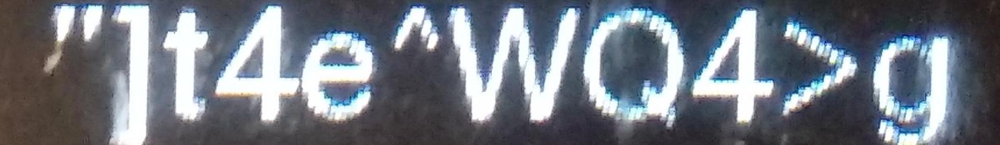

# OCR for Password Digits
implementation for Convolutional Recurrent Neural Network (CRNN) from ["An End-to-End Trainable Neural Network for Image-based Sequence Recognition and Its Application to Scene Text Recognition"](https://arxiv.org/abs/1507.05717) paper to recognize the password digits from an image.

## Data Set 
Used password images data set with 600 labeled images (500 training, 100 validation).
```
Dataset Alphabet : !"#$%&'()*+,-./0123456789:;<=>?@ABCDEFGHIJKLMNOPQRSTUVWXYZ[\]^_`abcdefghijklmnopqrstuvwxyz{|}~
```

<p align="center"></p>

## Model Performance
Evaluates the model on 100 images of passwords 

| Metric                         | value |
| -------------------------------|:-----:|
| Word Recognition Accuracy      | 81.00%|
| Character Recognition Accuracy | 95.07%|
| Character Recognition Precision| 94.05 |
| Character Recognition Recall   | 95.02 |
| Character Recognition F1_score | 94.09 |

## Requirements
```
python>=3.7
numpy
torch>=1.14.0
torchvision
matplotlib
tensorflow
tensorboard
pillow
```

## Installation
##### Clone and install requirements
    $ git clone https://github.com/omarAlezaby/OCR.git
    $ cd OCR/
    $ sudo pip3 install -r requirements.txt

##### Download pretrained weights
    $ cd Weights/
    $ bash download_weights.sh

## Recognize
Uses pre-trained weights to make recognize digits on images.
#### recognize
```
$ recognize.py [-h] [--batch_size BATCH_SIZE]
                [--use_cuda USE_GPU] 
                [--n_workers N_CPU]
                [--alphapet USED_ALPHABET]
                [--checkpoint_path WEIGHTS_PATH]
                [--fixed_seed RANDOM_SEED]
                [--imgs_folder IMGS_FOLDER]
```
#### Model Output
<p align="center"></p>

```
Recognized text: "]t4e^WQ4>g (raw output: ----"--]--t---4---e---^^--WW------Q-----44-->>---gg-----)
```
## Train on Dataset

#### Train
```
$ train.py [-h] [--epochs_num EPOCHS] [--batch_size BATCH_SIZE]
                [--use_cuda USE_GPU]  [--test_display NUMBER_TO_DISPLAY]
                [--weights_file PRETRAINED_WEIGHTS] [--n_workers N_CPU]
                [--lr LEARNING_RATE] [--fixed_seed RANDOM_SEED]
                [--val_each EVALUATION_INTERVAL] [--imgs_folder IMGS_FLODER]
                [--train_file TRAIN_FILE]  [--val_file VAL_FILE]
```
#### Download pretrained weights
    $ cd Weights/
    $ bash download_weights.sh
    
#### Image Folder
Move the images of your dataset single file.

#### Train File and Val File
CSV file that contained 2 columns, first contains the image files names, and the second image label 

#### Train
To train on the custom dataset run:
```
$ python3 train.py --imgs_folder data/ --train_file data_train.csv --val_file data_val.csv --weights_file crnn.pth
```

#### Tensorboard
Track training progress in Tensorboard:
* Initialize training
* Run the command below
* Go to http://localhost:6006/

```
$ tensorboard --logdir='logs' --port=6006
```

